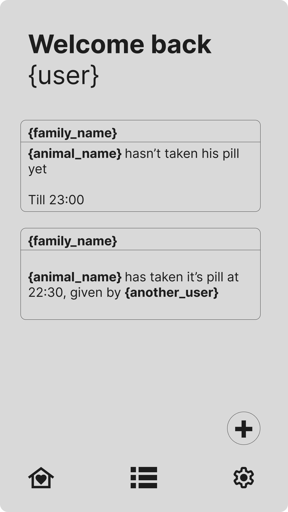
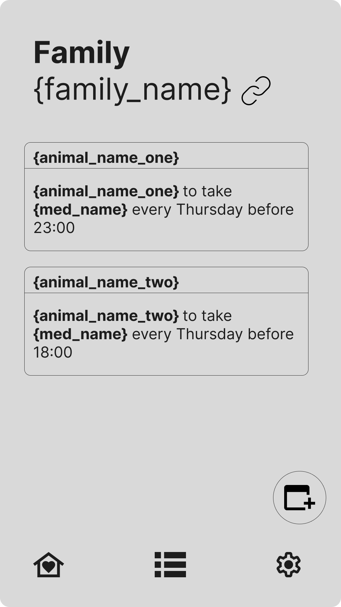

<p align="center">
  
  <br/>
  <strong>PetPillPal</strong>
  <br/><br/>
  
  
</p>

A cross-platform mobile app for coordinating pet medication schedules across family members in real time.

## Overview

PetPillPal allows households to track and coordinate medication schedules for their pets. Family members get notified when a dose is due and when someone has given it, preventing double-dosing and missed medications.

## Status
In active development — core features complete

## Features

- **Family spaces** — create or join a private family group with an invite code
- **Real-time sync** — see when a family member logs a dose instantly
- **Smart scheduling** — daily or weekly schedules with start/end dates
- **Overdue tracking** — missed doses from the last 7 days are surfaced
- **Push notifications** — 15, 30 or 60-minute reminders before scheduled doses
- **Dose logging** — confirm a dose was given with an undo option

## Tech Stack

| Layer | Technology |
|---|---|
| Mobile | Expo (React Native) + Expo Router |
| Styling | NativeWind (Tailwind CSS) |
| Backend | Supabase (PostgreSQL) |
| Auth | Supabase Auth |
| Real-time | Supabase Realtime subscriptions |
| Notifications | Expo Notifications + Supabase Edge Functions |
| CI/CD | GitHub Actions + EAS Build |

## Database Schema


### Tables
- `profiles` — extends Supabase auth, stores display name
- `families` — groups with unique invite codes
- `family_member` — many-to-many between profiles and families
- `animals` — pets belonging to a family
- `medications` — medications for each animal
- `medication_schedules` — when to give each medication
- `dose_logs` — audit trail of given doses
- `push_tokens` — device tokens for push notifications

## Architecture Decisions

**Why Expo over Flutter?**
Existing TypeScript/React experience from previous Next.js projects made Expo the faster path to shipping. Expo Router's file-based routing mirrors Next.js App Router closely.

**Why Supabase over Firebase?**
Relational data (families → animals → medications → schedules) maps naturally to PostgreSQL. Row Level Security handles multi-tenant access control at the database level without custom middleware.

**Why real-time subscriptions over polling?**
Core value of the app is coordination — seeing a family member log a dose instantly. Supabase Realtime subscriptions over WebSockets give sub-second updates without battery-draining polling.

## Security

- Row Level Security (RLS) on all tables
- Users can only read/write data from families they belong to
- Push tokens scoped to authenticated users
- No sensitive data in client-side code

## Setup

1. Clone the repo and install dependencies:
``` bash
git clone https://github.com/NawlFountains/PetMeds
cd PetMeds
npm install --legacy-peer-deps
```

2. Create a Supabase project at supabase.com and run `supabase/migrations/` in the SQL editor

3. Create `.env.local`:
```
EXPO_PUBLIC_SUPABASE_URL=your_project_url
EXPO_PUBLIC_SUPABASE_ANON_KEY=your_anon_key
```

4. Start the dev server:
```bash
npx expo start
```


## UI Design
[Live designs](http://figma.com/design/W091rggypYERO1ydwOYGrC)

<p align="center" >
  
    &nbsp;
  
</p>
<!--  -->
<!--  -->

## Stack
- **Frontend:** Expo (React Native) + Expo Router + NativeWind
- **Auth:** Supabase Auth
- **Database:** Supabase (PostgreSQL) with Row Level Security
- **Real-time:** Supabase Realtime subscriptions
- **Notifications:** Expo Notifications + Supabase Edge Functions
- **CI/CD:** GitHub Actions + EAS Build

## Features (planned)
- [x] User registration and login
- [x] Create or join a family group
- [x] Add pets and their medication schedules
- [x] Mark medications as given
- [x] See who gave the medication and when
- [x] Multi-day recurring schedules
- [x] Reminders for giving meds 
- [x] Push notification when an user logs a dose

## CI/CD

GitHub Actions triggers an EAS build on every push to `main`, producing an Android APK for internal testing.

For `feature/*` branches every push triggers a simple typescript check, also executed when creating a PR for `main`

## Author

Nawl Fountains
